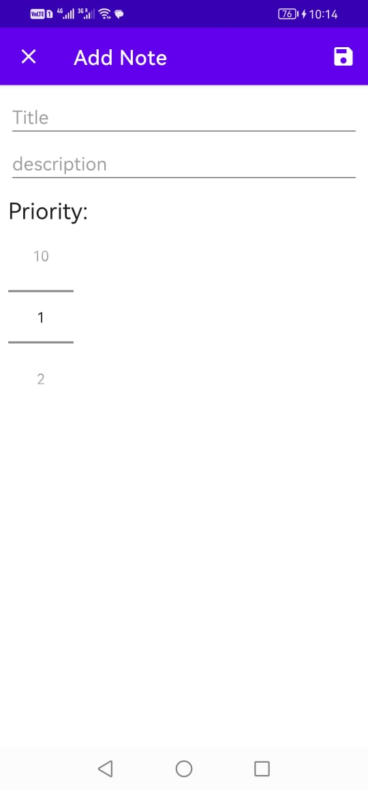
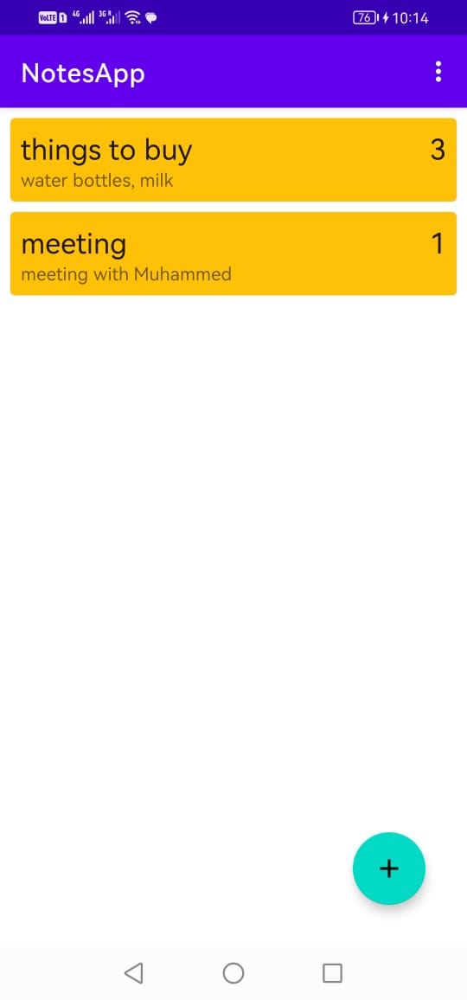

# NotesApp

## Overview

NotesApp is a feature-rich Android application designed for smartphones, serving as a comprehensive note-keeping solution. The app is tailored for users who wish to organize and manage their personal information, such as meeting notes, grocery lists, and more. Developed in Java and employing the MVVM architecture, NotesApp allows users to create, delete, and update notes, with deletion accomplished by swiping the screen right or left. Users can also assign priority levels to each note, enhancing organizational capabilities. The app uses Room Database to store all notes locally, ensuring data persistence.

## Features

- **Note Management:** Allows users to create, delete, and update notes for effective organization.
- **Swipe Deletion:** Enables note deletion by swiping the screen right or left, providing an intuitive interaction.
- **Priority Setting:** Allows users to set the priority level for each note, enhancing organizational capabilities.
- **MVVM Architecture:** Utilizes the MVVM architecture for organized and maintainable code.
- **Room Database:** Stores all notes locally using Room Database, ensuring data persistence.

## Technology Stack

- **Language:** Java
- **Architecture:** MVVM (Model-View-ViewModel)
- **Database:** Room Database

## Project Responsibilities

- **Android App Development:** Developed the Android application using Java, focusing on a clean and intuitive user interface and MVVM architecture for efficient data handling.
- **MVVM Architecture Implementation:** Followed MVVM architecture principles to separate concerns and enhance code maintainability.
- **Room Database Integration:** Utilized Room Database to store notes locally, ensuring data persistence and efficient retrieval.

## Outcome

NotesApp has proven to be a versatile and user-friendly note-keeping application, providing users with a seamless experience for managing personal information. The use of MVVM architecture ensures maintainable and well-organized code, and Room Database ensures reliable data storage and retrieval.

## Screenshots

